# Hybrid AD DS and Microsoft Entra Cloud Security Lab

This lab builds a small hybrid identity environment with Active Directory Domain Services, Microsoft Entra ID, Microsoft Entra Connect Sync, Log Analytics, and Microsoft Sentinel.

The goal is to show how on-premises identity connects to a cloud control plane, how selected users and groups sync into Microsoft Entra ID, how a Windows client proves domain and hybrid join state, and how identity activity can be monitored with KQL.

This is a student-budget build. For v1, `dc01` hosts AD DS, DNS, and Microsoft Entra Connect Sync. That saves one Azure VM. In a production-style design, Entra Connect Sync should run on a dedicated domain-joined member server such as `sync01`, because domain controllers are Tier 0 assets and should stay as close to single-purpose as possible.

## 1. Lab Goal and Architecture

We will build the lab with one Microsoft Entra tenant, one Azure subscription, and two Windows VMs.

| Component | Name | Purpose |
| --- | --- | --- |
| Resource group | `rg-hybrid-identity-lab` | Keeps the lab resources together |
| Virtual network | `vnet-hybrid-identity-lab` | Hosts the Windows VMs |
| Domain controller | `dc01` | AD DS, DNS, GPO, and Entra Connect Sync for the v1 lab |
| Windows client | `winclient01` | Domain join, GPO validation, hybrid join validation, and endpoint logging |
| AD DS domain | `lab.daehyung.dev` | Internal lab domain and user sign-in suffix |
| Microsoft Entra custom domain | `lab.daehyung.dev` | Verified custom domain for synced users |
| Log Analytics workspace | `law-hybrid-identity-lab` | Stores Windows and Entra logs |
| Microsoft Sentinel | Enabled on the workspace | Runs KQL detections and incidents |
| Terraform | `infra/terraform` | Deploys Azure infrastructure, monitoring, tag policy, optional RBAC, and optional Sentinel analytics |
| NIST CSF 2.0 mapping | `nist-csf-2.0-mapping.md` | Maps lab controls and evidence to CSF functions |

<evidence screenshot - Azure resource group showing dc01, winclient01, the VNet, and the Log Analytics workspace.>

The architecture is intentionally small. The lab should prove the identity path first, then add logging and detections after the sync and device state are working.

> [!NOTE]
> `dc01` combines AD DS, DNS, and Entra Connect Sync for cost control. A separate `sync01` member server is the better design for a work environment because it separates the domain controller from the sync engine and its cloud connectivity.

## 2. Cost, Licensing, and Student-Budget Decisions

Use Azure for Students or another student subscription if available. The main cost drivers are VM runtime, managed disks, Log Analytics ingestion, Log Analytics retention, and Microsoft Sentinel ingestion.

Keep the VMs stopped when they are not being used. Start with narrow Windows event collection instead of collecting every event channel.

This lab assumes Microsoft Entra Free unless the tenant license page proves that Microsoft Entra ID P1 or P2 is available.

| Feature | Student-budget plan |
| --- | --- |
| Security Defaults | Use as the baseline if Conditional Access is unavailable |
| Conditional Access | Implement only if P1 is available; otherwise document the design |
| Privileged Identity Management | Implement only if P2 or Entra ID Governance is available; otherwise document the design |
| Entra audit logs in Sentinel | Use if the connector is available |
| Entra sign-in logs in Sentinel | Use only if P1 or P2 is available |
| Entra Connect Health | Document as unavailable if P1 or P2 is not available |

<evidence screenshot - Entra licensing or Security Defaults page showing why Conditional Access, PIM, or SigninLogs were implemented or documented as design-only.>

The README should be honest about what was implemented and what was only designed. That makes the lab easier to defend in an interview.

### 2.1 Terraform Automation and NIST CSF 2.0

Terraform deploys the Azure foundation for this lab:

- Resource group
- VNet, subnet, DNS setting, and NSG
- `dc01` and `winclient01`
- Optional public IPs and a restricted RDP rule
- Log Analytics workspace
- Microsoft Sentinel onboarding
- Azure Monitor Agent extensions
- Data Collection Rule for selected Windows Security events
- Required-tag Azure Policy assignments
- Optional RBAC assignments after AD groups sync into Microsoft Entra ID
- Optional Sentinel scheduled analytics rules after `SecurityEvent` data exists

The Terraform files are in [infra/terraform](infra/terraform). Use them before the Windows and Entra configuration steps.

<evidence screenshot - terminal output showing terraform plan with the resource group, VMs, VNet, NSG, Log Analytics workspace, Sentinel onboarding, AMA extensions, DCR, and tag policy assignments ready to deploy.>

<evidence screenshot - terminal output showing terraform apply completed successfully with outputs for dc01, winclient01, and the Log Analytics workspace.>

Terraform does not configure AD DS, OUs, GPOs, Entra Connect Sync, or hybrid join. Those steps need Windows and portal validation evidence, so the README keeps them as guided lab work.

This lab follows NIST Cybersecurity Framework 2.0 across the six CSF functions: Govern, Identify, Protect, Detect, Respond, and Recover. The practical mapping is in [nist-csf-2.0-mapping.md](nist-csf-2.0-mapping.md).

<evidence screenshot - Azure Policy assignments showing required tag policies applied to the lab resource group.>

<evidence screenshot - nist-csf-2.0-mapping.md showing the lab evidence mapped to Govern, Identify, Protect, Detect, Respond, and Recover.>

## 3. Build `dc01` with AD DS, DNS, OUs, Groups, and GPOs

### 3.1 Create the Windows Server VM

Create `dc01` as a Windows Server VM in Azure. The Terraform deployment creates the VM, lab VNet, and static private IP address.

Set the VNet DNS server to the private IP address of `dc01` after AD DS and DNS are installed. This lets `winclient01` find the domain during domain join.

### 3.2 Install AD DS and DNS

Install the AD DS and DNS roles on `dc01`, then create a new forest named `lab.daehyung.dev`.

```powershell
Install-WindowsFeature AD-Domain-Services,DNS -IncludeManagementTools
```

After the role install, promote the server to a new forest.

```powershell
Install-ADDSForest `
  -DomainName "lab.daehyung.dev" `
  -DomainNetbiosName "LAB" `
  -InstallDNS `
  -Force
```

After the restart, sign in with a domain admin account.


### 3.3 Create the OU Structure

Create OUs that separate synced identities from non-synced service accounts.

Recommended OU structure:

```text
lab.daehyung.dev
  lab
    lab_synced
      lab_users
      lab_groups
      lab_computers
    lab_privileged
      lab_admins
    lab_service_accounts
```


```powershell
Import-Module ActiveDirectory

$root = "DC=lab,DC=daehyung,DC=dev"

New-ADOrganizationalUnit -Name "lab" -Path $root -ProtectedFromAccidentalDeletion $true

New-ADOrganizationalUnit -Name "lab_synced" -Path "OU=lab,$root" -ProtectedFromAccidentalDeletion $true
New-ADOrganizationalUnit -Name "lab_privileged" -Path "OU=lab,$root" -ProtectedFromAccidentalDeletion $true
New-ADOrganizationalUnit -Name "lab_service_accounts" -Path "OU=lab,$root" -ProtectedFromAccidentalDeletion $true

New-ADOrganizationalUnit -Name "lab_users" -Path "OU=lab_synced,OU=lab,$root" -ProtectedFromAccidentalDeletion $true
New-ADOrganizationalUnit -Name "lab_groups" -Path "OU=lab_synced,OU=lab,$root" -ProtectedFromAccidentalDeletion $true
New-ADOrganizationalUnit -Name "lab_computers" -Path "OU=lab_synced,OU=lab,$root" -ProtectedFromAccidentalDeletion $true

New-ADOrganizationalUnit -Name "lab_admins" -Path "OU=lab_privileged,OU=lab,$root" -ProtectedFromAccidentalDeletion $true
```


We will scope Entra Connect Sync to the OUs that belong in Microsoft Entra ID. `lab_service_accounts` stays out of scope to show that service accounts should not sync by default.


### 3.4 Create Lab Users and Groups

Create test users in `lab_users` and lab-specific groups in `lab_groups`.

Recommended groups:

| Group | Purpose |
| --- | --- |
| `Azure Subscription Reader` (`GRP_AZ_Reader`) | Maps to Azure subscription Reader access |
| `Log Analytics Reader` (`GRP_LA_Reader`) | Maps to Log Analytics read access |
| `Sentinel Responder` (`GRP_SEN_Responder`) | Maps to Microsoft Sentinel Responder access |
| `Sentinel Contributor` (`GRP_SEN_Contributor`) | Maps to Microsoft Sentinel Contributor access |
| `Helpdesk Password Reset` (`GRP_HD_PwdReset`) | Used to test delegated password reset activity |
| `Server Local Admins` (`GRP_SRV_LocalAdmins`) | Used to test local admin assignment through GPO |

Do not build the cloud access model around built-in groups such as `Domain Admins` or `Enterprise Admins`. Microsoft Entra Connect filters some high-privilege built-in AD objects by default, and production access should be mapped through explicit groups anyway.

```powershell
Import-Module ActiveDirectory

$tenantSuffix = "lab.daehyung.dev"
$root = (Get-ADDomain).DistinguishedName

$groupsPath = "OU=lab_groups,OU=lab_synced,OU=lab,$root"
$usersPath = "OU=lab_users,OU=lab_synced,OU=lab,$root"
$adminsPath = "OU=lab_admins,OU=lab_privileged,OU=lab,$root"

New-ADGroup -Name "Azure Subscription Reader" -SamAccountName "GRP_AZ_Reader" -GroupCategory Security -GroupScope Global -Path $groupsPath -Description "Lab group for Azure subscription Reader access."

New-ADGroup -Name "Log Analytics Reader" -SamAccountName "GRP_LA_Reader" -GroupCategory Security -GroupScope Global -Path $groupsPath -Description "Lab group for Log Analytics Reader access."

New-ADGroup -Name "Sentinel Responder" -SamAccountName "GRP_SEN_Responder" -GroupCategory Security -GroupScope Global -Path $groupsPath -Description "Lab group for Microsoft Sentinel Responder access."

New-ADGroup -Name "Sentinel Contributor" -SamAccountName "GRP_SEN_Contributor" -GroupCategory Security -GroupScope Global -Path $groupsPath -Description "Lab group for Microsoft Sentinel Contributor access."

New-ADGroup -Name "Helpdesk Password Reset" -SamAccountName "GRP_HD_PwdReset" -GroupCategory Security -GroupScope Global -Path $groupsPath -Description "Lab group used to test delegated password reset activity."

New-ADGroup -Name "Server Local Admins" -SamAccountName "GRP_SRV_LocalAdmins" -GroupCategory Security -GroupScope Global -Path $groupsPath -Description "Lab group used to test local administrator assignment."

$password = Read-Host "Enter initial password for lab users" -AsSecureString

New-ADUser -Name "Alice LabUser" -GivenName "Alice" -Surname "LabUser" -SamAccountName "alice" -UserPrincipalName "alice@$tenantSuffix" -Path $usersPath -AccountPassword $password -Enabled $true -ChangePasswordAtLogon $true

New-ADUser -Name "Bob LabUser" -GivenName "Bob" -Surname "LabUser" -SamAccountName "bob" -UserPrincipalName "bob@$tenantSuffix" -Path $usersPath -AccountPassword $password -Enabled $true -ChangePasswordAtLogon $true

New-ADUser -Name "Charlie LabAdmin" -GivenName "Charlie" -Surname "LabAdmin" -SamAccountName "charlie" -UserPrincipalName "charlie@$tenantSuffix" -Path $adminsPath -AccountPassword $password -Enabled $true -ChangePasswordAtLogon $true

Add-ADGroupMember -Identity "GRP_AZ_Reader" -Members "alice"
Add-ADGroupMember -Identity "GRP_LA_Reader" -Members "alice"
Add-ADGroupMember -Identity "GRP_SEN_Responder" -Members "charlie"
Add-ADGroupMember -Identity "GRP_HD_PwdReset" -Members "bob"
```


### 3.5 Configure GPO Baselines

Create a small set of GPOs that generate security evidence and are easy to explain.

Recommended GPOs:

| GPO | Target | Lab purpose |
| --- | --- | --- |
| `GPO-Workstations-WindowsFirewall` | `lab_computers` OU | Confirm firewall policy applies to `winclient01` |
| `GPO-Workstations-AuditPolicy` | `lab_computers` OU | Collect useful endpoint security events |
| `GPO-Domain-AccountPolicy` | Domain root | Set account lockout and password policy |
| `GPO-DC-AdvancedAuditPolicy` | Domain Controllers OU | Generate AD account, group, and directory change events |
| `GPO-Workstations-LocalAdmins` | `lab_computers` OU | Assign a lab group to local admins for controlled testing |

For AD DS monitoring, enable audit categories for account management, security group management, logon, Kerberos activity, and directory service changes. Event ID `5136` needs the right directory object auditing to show object modification details.

## 4. Verify `lab.daehyung.dev` in Microsoft Entra

The AD DS domain and user UPN suffix are both `lab.daehyung.dev`. Before syncing users, verify `lab.daehyung.dev` as a custom domain in Microsoft Entra ID.

In Microsoft Entra admin center, go to **Identity > Settings > Domain names**, add `lab.daehyung.dev`, then create the TXT record in public DNS for `daehyung.dev`.

After Microsoft Entra verifies the domain, synced users can keep UPNs such as `alice@lab.daehyung.dev`.

```powershell
Get-ADUser alice -Properties UserPrincipalName | Select-Object UserPrincipalName
```

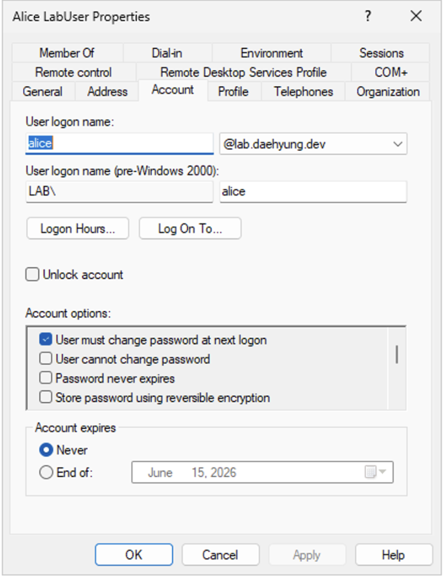


Now the user has an on-premises AD identity with a verified cloud sign-in name.

## 5. Install and Configure Microsoft Entra Connect Sync on `dc01`

### 5.1 Lab Design Note

We will install Microsoft Entra Connect Sync on `dc01` for this v1 lab. This is a cost-saving choice, not the preferred production design.

Microsoft documents that the Microsoft Entra Connect server is a Tier 0 component and should be hardened. Microsoft also recommends securing domain controllers more strictly than normal infrastructure. Combining the roles means one VM carries both sets of risk, so the README must call this out.

### 5.2 Prepare `dc01`

Before installing Entra Connect Sync:

- Confirm `dc01` is fully patched.
- Confirm TLS 1.2 and the required .NET version are available.
- Confirm the server has a full GUI. Entra Connect Sync does not support Windows Server Core.
- Confirm the AD DS domain controller is writable.
- Confirm the Entra account used for setup has the required role assigned directly. Group membership alone does not meet this setup requirement.


### 5.3 Use Custom Settings

Download Microsoft Entra Connect Sync from the Microsoft Entra admin center and run the installer on `dc01`.

Use Custom settings.


Select:

- Password Hash Synchronization
- OU filtering
- The OUs that should sync, such as `lab_users`, `lab_groups`, and `lab_computers`
- No AD FS for v1

Do not sync `lab_service_accounts`.


After setup, record the installed version.

```powershell
Get-Item "C:\Program Files\Microsoft Azure AD Sync\Bin\miiserver.exe" |
  Select-Object VersionInfo
```

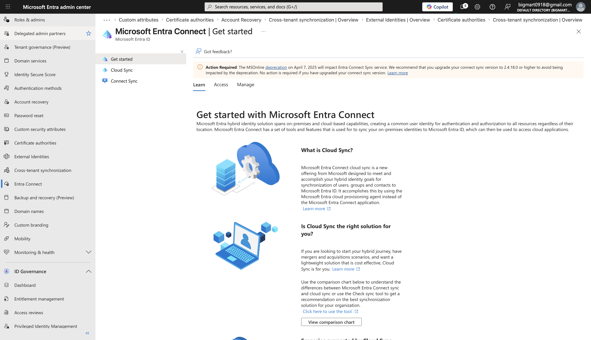

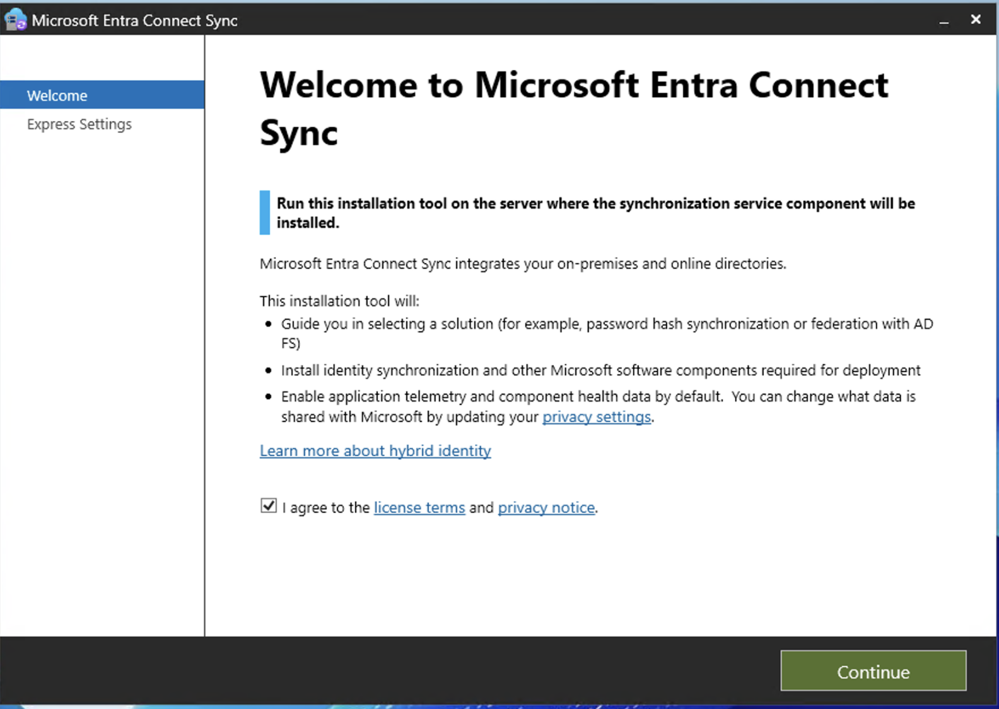


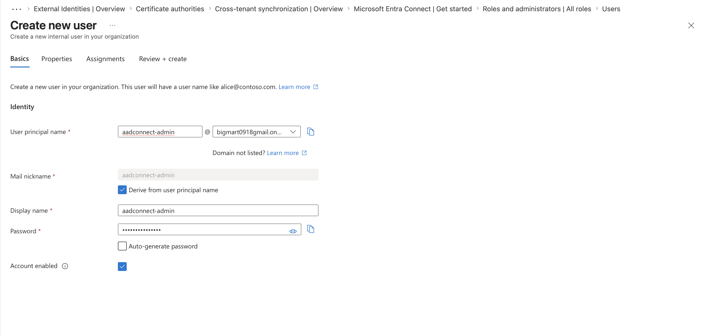

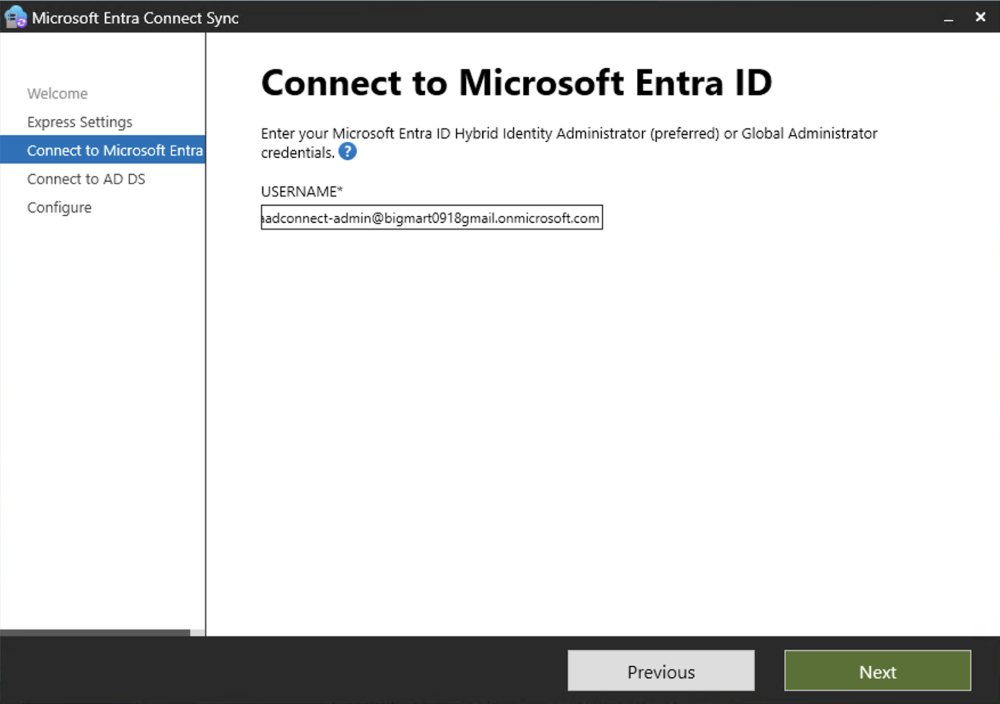


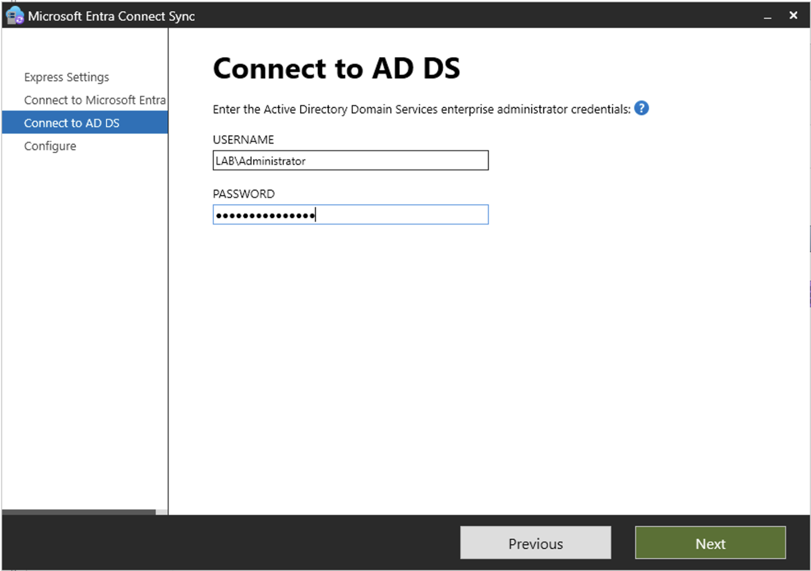

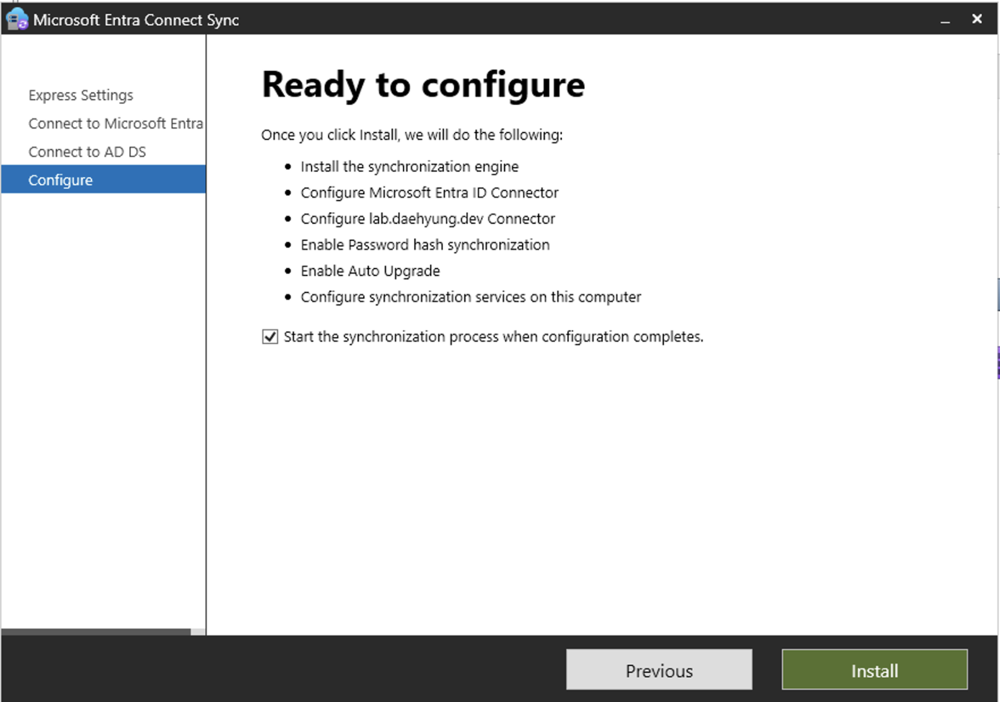

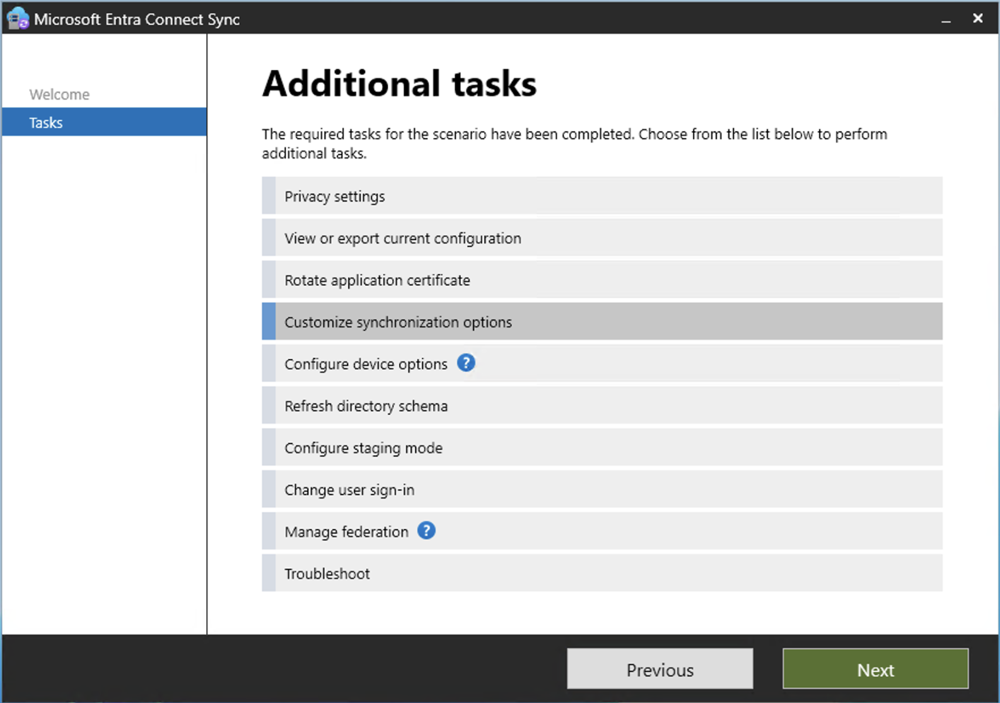


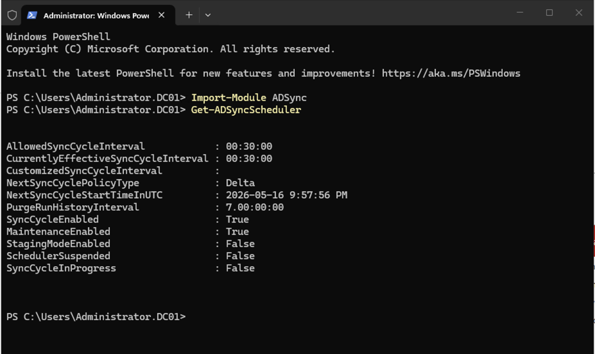

### 5.4 Force the First Sync

After the wizard completes, force a sync if needed.

```powershell
Import-Module ADSync
Start-ADSyncSyncCycle -PolicyType Delta
```

Use the Synchronization Service Manager to confirm that exports to Microsoft Entra ID are successful.


## 6. Verify Synced Users and Groups in Microsoft Entra

Open the Microsoft Entra admin center and check the synced users and groups.


Expected result:

- Test users from `lab_users` appear in Microsoft Entra ID.
- Lab groups from `lab_groups` appear in Microsoft Entra ID.
- Objects from `lab_service_accounts` do not appear.
- Synced users use the `lab.daehyung.dev` UPN suffix.

<evidence screenshot - Microsoft Entra admin center showing synced users and groups from the lab OUs.>

This proves that sync scoping is working and that the lab is not pushing every on-premises object into the cloud tenant.

## 7. Build and Domain-Join `winclient01`

Create `winclient01` as a Windows 11 VM or a Windows Server member system. The Terraform deployment uses Windows Server by default so the image is easy to deploy in a student subscription. A Windows client OS is better for showing endpoint identity behavior, but a member server can still prove the basic domain and hybrid join path.

Make sure `winclient01` uses the VNet DNS setting that points to `dc01`.

Join the domain.

```powershell
Add-Computer -DomainName "lab.daehyung.dev" -Restart
```

After restart, move the computer object into the `lab_computers` OU.

```powershell
Move-ADObject `
  -Identity "CN=WINCLIENT01,CN=Computers,DC=lab,DC=daehyung,DC=dev" `
  -TargetPath "OU=lab_computers,OU=lab_synced,OU=lab,DC=lab,DC=daehyung,DC=dev"
```

Apply GPO and confirm domain identity.

```powershell
gpupdate /force
whoami
gpresult /r
```

## 8. Configure and Validate Hybrid Join

Configure Microsoft Entra hybrid join for the domain-joined device.

For v1, the important requirements are:

- The computer object for `winclient01` is in a synced OU.
- The Service Connection Point is configured by Entra Connect.
- `winclient01` can reach Microsoft registration and sign-in endpoints.
- Device registration completes successfully.

On `winclient01`, run:

```cmd
dsregcmd /status
```

Expected values:

```text
AzureAdJoined : YES
DomainJoined  : YES
DeviceAuthStatus : SUCCESS
```

<evidence screenshot - winclient01 output from dsregcmd /status showing AzureAdJoined YES, DomainJoined YES, and DeviceAuthStatus SUCCESS.>

Then confirm the device in Microsoft Entra.

<evidence screenshot - Microsoft Entra Devices page showing winclient01 as a hybrid joined device.>

If registration fails, save the `dsregcmd /status` diagnostics. The output can show whether the issue is AD connectivity, SCP configuration, DRS discovery, or token acquisition.

## 9. Configure Log Analytics, AMA, and Microsoft Sentinel

### 9.1 Create the Workspace and Enable Sentinel

Create the Log Analytics workspace `law-hybrid-identity-lab`, then enable Microsoft Sentinel on the workspace.

Sentinel is tied to the workspace. It is not another Windows server.

### 9.2 Collect Windows Security Events

Use Azure Monitor Agent and a Data Collection Rule to collect Windows security events from `dc01` and `winclient01`.

Start narrow. Collect events needed for identity administration and AD change tracking first.

Recommended event IDs:

| Event ID | Meaning |
| --- | --- |
| `4672` | Special privileges assigned at logon |
| `4720` | User account created |
| `4724` | Password reset attempted |
| `4725` | User account disabled |
| `4726` | User account deleted |
| `4728` | Member added to global security group |
| `4729` | Member removed from global security group |
| `4732` | Member added to local security group |
| `4733` | Member removed from local security group |
| `4740` | User account locked out |
| `4756` | Member added to universal security group |
| `4757` | Member removed from universal security group |
| `4768` | Kerberos authentication ticket requested |
| `4769` | Kerberos service ticket requested |
| `4771` | Kerberos pre-authentication failed |
| `5136` | Directory object modified |

<evidence screenshot - Log Analytics or Sentinel showing SecurityEvent data from dc01 or winclient01.>

### 9.3 Connect Microsoft Entra Logs

Use the Microsoft Entra ID data connector in Sentinel.

Collect audit logs if available. Collect sign-in logs only if the tenant has Microsoft Entra ID P1 or P2. Microsoft documents that P1 or P2 is required to ingest sign-in logs into Sentinel.

## 10. Create and Test KQL Detections

Each detection should have a test action, a KQL query, and evidence.

### 10.1 Privileged AD Group Membership Changes

Test action: add a test user to one lab admin group, then remove the user.

```powershell
Add-ADGroupMember -Identity "GRP_SRV_LocalAdmins" -Members "alice"
Remove-ADGroupMember -Identity "GRP_SRV_LocalAdmins" -Members "alice" -Confirm:$false
```

KQL:

```kql
SecurityEvent
| where EventID in (4728, 4729, 4732, 4733, 4756, 4757)
| where RenderedDescription has_any (
    "Azure Subscription Reader",
    "Log Analytics Reader",
    "Sentinel Responder",
    "Sentinel Contributor",
    "Helpdesk Password Reset",
    "Server Local Admins",
    "GRP_AZ_Reader",
    "GRP_LA_Reader",
    "GRP_SEN_Responder",
    "GRP_SEN_Contributor",
    "GRP_HD_PwdReset",
    "GRP_SRV_LocalAdmins",
    "Domain Admins",
    "Enterprise Admins",
    "Administrators",
    "Schema Admins",
    "Account Operators"
)
| project TimeGenerated, Computer, EventID, Account, RenderedDescription
| order by TimeGenerated desc
```

<evidence screenshot - KQL results for privileged AD group membership changes after adding and removing a test user.>

This detection shows when an identity gains or loses privileged access through AD group membership.

### 10.2 Password Reset, Disabled Account, or Deleted Account Activity

Test action: reset a test user's password, disable the account, then re-enable it.

```powershell
Set-ADAccountPassword -Identity "alice" -Reset -NewPassword (ConvertTo-SecureString "TempPassword123!" -AsPlainText -Force)
Disable-ADAccount -Identity "alice"
Enable-ADAccount -Identity "alice"
```

KQL:

```kql
SecurityEvent
| where EventID in (4724, 4725, 4726)
| summarize Count=count() by EventID, Account, Computer, bin(TimeGenerated, 1h)
| order by TimeGenerated desc
```

<evidence screenshot - KQL results for password reset, account disable, or account delete activity against a test user.>

This detection helps review account takeover response actions and suspicious account administration.

### 10.3 GPO or AD Object Modification Trail

Test action: change a safe setting in a test GPO.

KQL:

```kql
SecurityEvent
| where EventID == 5136
| where RenderedDescription has "CN=Policies,CN=System"
| project TimeGenerated, Computer, Account, RenderedDescription
| order by TimeGenerated desc
```

<evidence screenshot - KQL results for Event ID 5136 after changing a test GPO setting.>

This detection shows changes to AD objects that can affect many users or computers.

### 10.4 New Privileged Role Assignment in Microsoft Entra

Test action: assign a low-risk test role to a lab group if the tenant allows it, then remove it.

KQL:

```kql
AuditLogs
| where Category == "RoleManagement"
| where ActivityDisplayName has_any (
    "Add member to role",
    "Add eligible member to role",
    "Add member to role outside of PIM"
)
| project TimeGenerated, ActivityDisplayName, InitiatedBy, TargetResources, Result
| order by TimeGenerated desc
```

<evidence screenshot - KQL results for Microsoft Entra privileged role assignment activity after assigning and removing a test role from a lab group.>

This detection shows cloud-side privileged role assignment activity.

### 10.5 Failed Entra Sign-In Spike

Use this only if `SigninLogs` is available in the workspace.

Test action: generate failed sign-ins against a lab user without locking the account.

KQL:

```kql
SigninLogs
| where tostring(ResultType) != "0"
| summarize FailedAttempts=count(),
    UserCount=dcount(UserPrincipalName),
    IPCount=dcount(IPAddress)
    by bin(TimeGenerated, 15m)
| where FailedAttempts >= 10
| order by TimeGenerated desc
```

<evidence screenshot - KQL results for failed Entra sign-in activity showing failed attempts grouped into a 15-minute window.>

If `SigninLogs` is not available because the tenant lacks P1 or P2, keep this as a design-only detection and explain the licensing limit.

### 10.6 Sentinel Analytic Rule

Turn one validated query into a scheduled analytics rule in Sentinel.

Recommended first rule: privileged AD group membership changes.

<evidence screenshot - Sentinel analytic rule or incident generated from one validated lab detection.>

The analytic rule proves that the lab can turn identity activity into an alert workflow.

## 11. RBAC, Emergency Access, and Conditional Access Design

### 11.1 Azure and Sentinel RBAC

Use group-based access instead of assigning users directly.

Recommended mapping:

| Synced group | Azure or Sentinel role |
| --- | --- |
| `Azure Subscription Reader` (`GRP_AZ_Reader`) | Reader on the subscription |
| `Log Analytics Reader` (`GRP_LA_Reader`) | Log Analytics Reader on the workspace |
| `Sentinel Responder` (`GRP_SEN_Responder`) | Microsoft Sentinel Responder |
| `Sentinel Contributor` (`GRP_SEN_Contributor`) | Microsoft Sentinel Contributor |

Keep role assignment cumulative behavior in mind. If a user has multiple role paths, the effective permission is the sum of those assignments.

After the AD groups sync into Microsoft Entra ID, add their object IDs to `infra/terraform/terraform.tfvars` and run Terraform again. Terraform can then assign the Azure and Sentinel roles from code.

<evidence screenshot - terraform plan showing RBAC role assignments for the synced Microsoft Entra groups.>

### 11.2 Emergency Access Accounts

Create two cloud-only emergency access accounts. These accounts should not depend on AD DS, Entra Connect Sync, or the normal admin authentication path.

Document:

- Account names
- Where credentials are stored
- Which roles are assigned
- Which Conditional Access policies exclude them
- When the accounts are tested

Do not sync emergency access accounts from AD DS.

### 11.3 Security Defaults, Conditional Access, and PIM

If the tenant only has Entra Free, use Security Defaults for baseline MFA behavior and document Conditional Access as a target design.

If P1 is available, implement a small pilot Conditional Access policy:

- Target a pilot admin group first.
- Require MFA for privileged admin access.
- Exclude emergency access accounts.
- Test with report-only mode first if available.

If P2 is available, document or implement Privileged Identity Management for eligible admin role assignment.

The README should never claim that Conditional Access or PIM was enforced unless the license and screenshots prove it.

## 12. Evidence Timeline

The screenshots below are ordered by capture sequence.


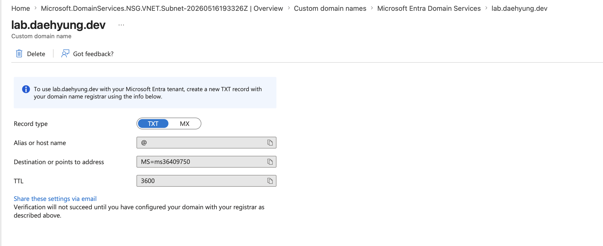


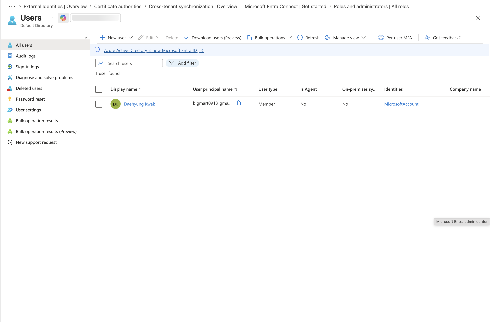
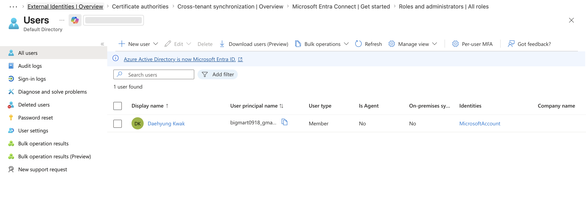


## 13. Evidence Checklist

Use this checklist as the lab evidence pack.

- <evidence screenshot - Azure resource group showing dc01, winclient01, the VNet, and the Log Analytics workspace.>
- <evidence screenshot - terminal output showing terraform plan with the resource group, VMs, VNet, NSG, Log Analytics workspace, Sentinel onboarding, AMA extensions, DCR, and tag policy assignments ready to deploy.>
- <evidence screenshot - terminal output showing terraform apply completed successfully with outputs for dc01, winclient01, and the Log Analytics workspace.>
- <evidence screenshot - Azure Policy assignments showing required tag policies applied to the lab resource group.>
- <evidence screenshot - nist-csf-2.0-mapping.md showing the lab evidence mapped to Govern, Identify, Protect, Detect, Respond, and Recover.>
- AD Users and Computers OU structure:


- Synced user UPN suffix:


- Microsoft Entra Connect Sync configuration:


- <evidence screenshot - Microsoft Entra admin center showing synced users and groups from the lab OUs.>
- <evidence screenshot - winclient01 output from dsregcmd /status showing AzureAdJoined YES, DomainJoined YES, and DeviceAuthStatus SUCCESS.>
- <evidence screenshot - Microsoft Entra Devices page showing winclient01 as a hybrid joined device.>
- <evidence screenshot - Log Analytics or Sentinel showing SecurityEvent data from dc01 or winclient01.>
- <evidence screenshot - KQL results for privileged AD group membership changes after adding and removing a test user.>
- <evidence screenshot - KQL results for password reset, account disable, or account delete activity against a test user.>
- <evidence screenshot - KQL results for Event ID 5136 after changing a test GPO setting.>
- <evidence screenshot - KQL results for Microsoft Entra privileged role assignment activity after assigning and removing a test role from a lab group.>
- <evidence screenshot - KQL results for failed Entra sign-in activity showing failed attempts grouped into a 15-minute window.>
- <evidence screenshot - Sentinel analytic rule or incident generated from one validated lab detection.>
- <evidence screenshot - terraform plan showing RBAC role assignments for the synced Microsoft Entra groups.>
- <evidence screenshot - Entra licensing or Security Defaults page showing why Conditional Access, PIM, or SigninLogs were implemented or documented as design-only.>

## 14. Cloud Sync and Defender Portal Future Notes

This lab uses Microsoft Entra Connect Sync because many real environments still run hybrid AD DS with Connect Sync. The lab should still mention that Microsoft Entra Cloud Sync is the newer direction for many synchronization scenarios.

See [cloud-sync-migration-notes.md](cloud-sync-migration-notes.md) for the migration design notes.

Microsoft Sentinel is also moving to the Microsoft Defender portal experience. Microsoft states that after March 31, 2027, Sentinel will no longer be supported in the Azure portal and will be available only in the Defender portal. This lab can be built with the available portal workflow, but the documentation should mention the Defender portal transition.

## 15. Validation Checklist

Before calling the lab complete, verify each item.

- Run Terraform and confirm the Azure foundation deploys without manual portal creation.
- Confirm required tags are applied to the lab resources.
- Confirm Azure Policy assignments exist for required tags, or document why policy assignment was disabled.
- Create a test AD user and group in the synced OU.
- Force a sync and confirm both objects appear in Microsoft Entra ID.
- Confirm objects in `lab_service_accounts` do not appear in Microsoft Entra ID.
- Confirm the synced user uses the `lab.daehyung.dev` UPN suffix.
- Confirm `winclient01` is domain joined.
- Confirm `winclient01` is hybrid joined.
- Generate password reset, account disable, privileged group change, and GPO modification events.
- Run each KQL query and save matching evidence.
- Create one Sentinel analytic rule from a validated detection.
- Confirm the NIST CSF 2.0 mapping has evidence for Govern, Identify, Protect, Detect, Respond, and Recover.
- Confirm implemented controls are separated from design-only controls blocked by licensing.

## 16. References

- [Securing domain controllers against attack](https://learn.microsoft.com/en-us/windows-server/identity/ad-ds/plan/security-best-practices/securing-domain-controllers-against-attack)
- [Microsoft Entra Connect prerequisites](https://learn.microsoft.com/en-us/entra/identity/hybrid/connect/how-to-connect-install-prerequisites)
- [Microsoft Entra Connect accounts and permissions](https://learn.microsoft.com/en-us/entra/identity/hybrid/connect/reference-connect-accounts-permissions)
- [Microsoft Entra Connect Sync service account](https://learn.microsoft.com/en-us/entra/identity/hybrid/connect/concept-adsync-service-account)
- [Microsoft Entra hybrid join verification](https://learn.microsoft.com/en-gb/entra/identity/devices/how-to-hybrid-join-verify)
- [Send Microsoft Entra ID data to Microsoft Sentinel](https://learn.microsoft.com/en-us/azure/sentinel/connect-azure-active-directory)
- [Microsoft Sentinel in the Microsoft Defender portal](https://learn.microsoft.com/en-us/azure/sentinel/microsoft-sentinel-defender-portal)
- [Microsoft Entra data retention](https://learn.microsoft.com/en-us/entra/identity/monitoring-health/reference-reports-data-retention)
- [NIST Cybersecurity Framework](https://www.nist.gov/cyberframework)
- [NIST Cybersecurity Framework 2.0](https://doi.org/10.6028/NIST.CSWP.29)
