# Hybrid AD DS and Entra Identity Security Assessment

This assessment builds a mini hybrid identity environment with Active Directory Domain Services, Microsoft Entra ID, Microsoft Entra Connect Sync, Log Analytics, and Microsoft Sentinel which is a common security architecture for companies relying on Active Directory.

The goal is to show how on-premises identity connects to a cloud control plane, how selected users and groups sync into Microsoft Entra ID, how a Windows client proves domain and hybrid join state, and how identity activity can be monitored with KQL.

## 1. Build `dc01` with AD DS, DNS, OUs, Groups, and GPOs

### 1.1 Create the Windows Server VM

Create `dc01` as a Windows Server VM in Azure. The Terraform deployment creates the VM, lab VNet, and static private IP address.

Set the VNet DNS server to the private IP address of `dc01` after AD DS and DNS are installed. This lets `winclient01` find the domain during domain join.

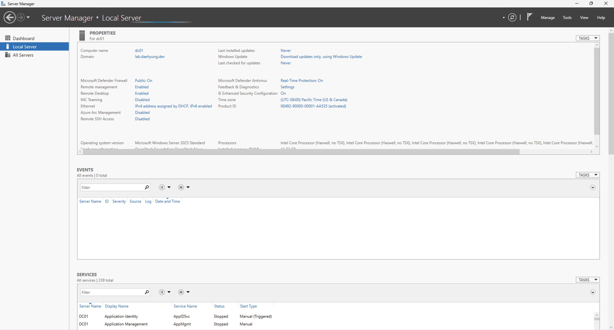

### 1.2 Install AD DS and DNS

Install the AD DS and DNS roles on `dc01`, then create a new forest named `lab.daehyung.dev`.

```powershell
Install-WindowsFeature AD-Domain-Services,DNS -IncludeManagementTools
```

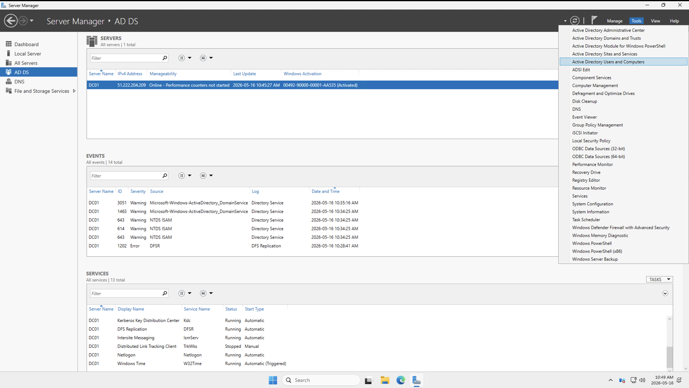

After the role install, promote the server to a new forest.

```powershell
Install-ADDSForest `
  -DomainName "lab.daehyung.dev" `
  -DomainNetbiosName "LAB" `
  -InstallDNS `
  -Force
```

After the restart, sign in with a domain admin account.

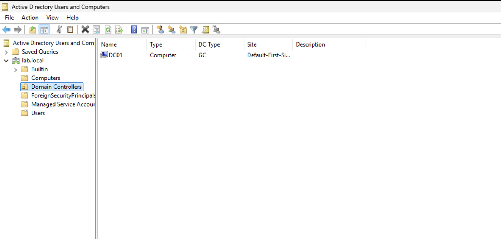


### 1.3 Create the OU Structure

Create OUs that separate synced identities from non-synced service accounts.

Recommended OU structure:

```text
lab.daehyung.dev
  lab
    lab_synced
      lab_users
      lab_groups
      lab_computers
    lab_privileged
      lab_admins
    lab_service_accounts
```

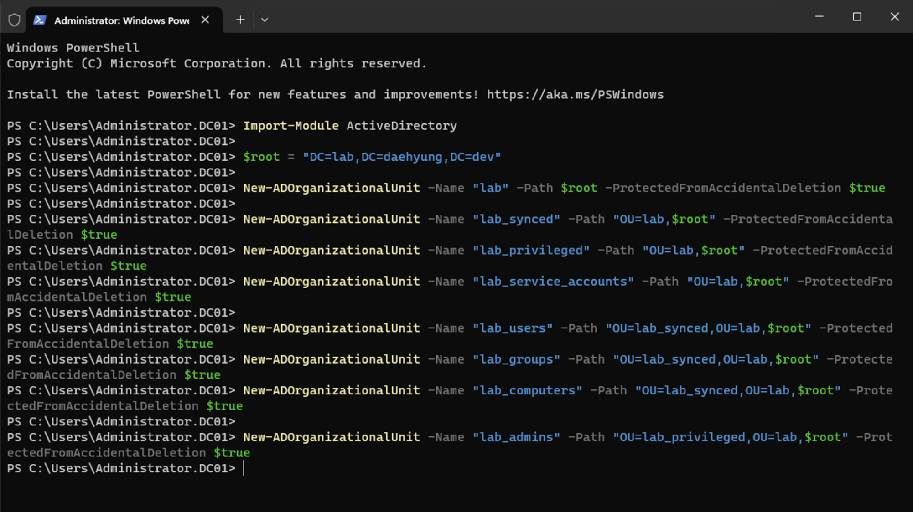

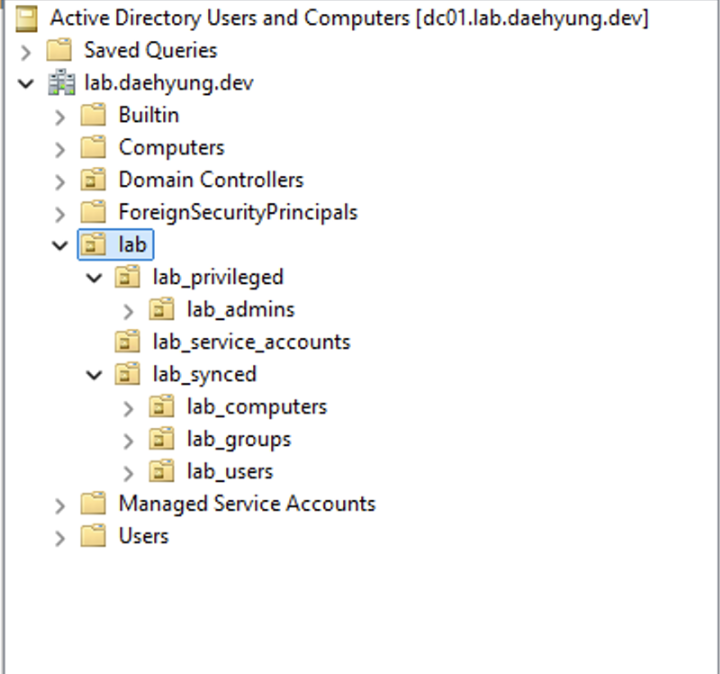

```powershell
Import-Module ActiveDirectory

$root = "DC=lab,DC=daehyung,DC=dev"

New-ADOrganizationalUnit -Name "lab" -Path $root -ProtectedFromAccidentalDeletion $true

New-ADOrganizationalUnit -Name "lab_synced" -Path "OU=lab,$root" -ProtectedFromAccidentalDeletion $true
New-ADOrganizationalUnit -Name "lab_privileged" -Path "OU=lab,$root" -ProtectedFromAccidentalDeletion $true
New-ADOrganizationalUnit -Name "lab_service_accounts" -Path "OU=lab,$root" -ProtectedFromAccidentalDeletion $true

New-ADOrganizationalUnit -Name "lab_users" -Path "OU=lab_synced,OU=lab,$root" -ProtectedFromAccidentalDeletion $true
New-ADOrganizationalUnit -Name "lab_groups" -Path "OU=lab_synced,OU=lab,$root" -ProtectedFromAccidentalDeletion $true
New-ADOrganizationalUnit -Name "lab_computers" -Path "OU=lab_synced,OU=lab,$root" -ProtectedFromAccidentalDeletion $true

New-ADOrganizationalUnit -Name "lab_admins" -Path "OU=lab_privileged,OU=lab,$root" -ProtectedFromAccidentalDeletion $true
```

We will scope Entra Connect Sync to the OUs that belong in Microsoft Entra ID. `lab_service_accounts` stays out of scope to show that service accounts should not sync by default.


### 1.4 Create Lab Users and Groups

Create test users in `lab_users` and lab-specific groups in `lab_groups`.

Recommended groups:

| Group | Purpose |
| --- | --- |
| `Azure Subscription Reader` (`GRP_AZ_Reader`) | Maps to Azure subscription Reader access |
| `Log Analytics Reader` (`GRP_LA_Reader`) | Maps to Log Analytics read access |
| `Sentinel Responder` (`GRP_SEN_Responder`) | Maps to Microsoft Sentinel Responder access |
| `Sentinel Contributor` (`GRP_SEN_Contributor`) | Maps to Microsoft Sentinel Contributor access |
| `Helpdesk Password Reset` (`GRP_HD_PwdReset`) | Used to test delegated password reset activity |
| `Server Local Admins` (`GRP_SRV_LocalAdmins`) | Used to test local admin assignment through GPO |

> [!NOTE]
> Do not build the cloud access model around built-in groups such as `Domain Admins` or `Enterprise Admins`.

```powershell
Import-Module ActiveDirectory

$tenantSuffix = "lab.daehyung.dev"
$root = (Get-ADDomain).DistinguishedName

$groupsPath = "OU=lab_groups,OU=lab_synced,OU=lab,$root"
$usersPath = "OU=lab_users,OU=lab_synced,OU=lab,$root"
$adminsPath = "OU=lab_admins,OU=lab_privileged,OU=lab,$root"

New-ADGroup -Name "Azure Subscription Reader" -SamAccountName "GRP_AZ_Reader" -GroupCategory Security -GroupScope Global -Path $groupsPath -Description "Lab group for Azure subscription Reader access."

New-ADGroup -Name "Log Analytics Reader" -SamAccountName "GRP_LA_Reader" -GroupCategory Security -GroupScope Global -Path $groupsPath -Description "Lab group for Log Analytics Reader access."

New-ADGroup -Name "Sentinel Responder" -SamAccountName "GRP_SEN_Responder" -GroupCategory Security -GroupScope Global -Path $groupsPath -Description "Lab group for Microsoft Sentinel Responder access."

New-ADGroup -Name "Sentinel Contributor" -SamAccountName "GRP_SEN_Contributor" -GroupCategory Security -GroupScope Global -Path $groupsPath -Description "Lab group for Microsoft Sentinel Contributor access."

New-ADGroup -Name "Helpdesk Password Reset" -SamAccountName "GRP_HD_PwdReset" -GroupCategory Security -GroupScope Global -Path $groupsPath -Description "Lab group used to test delegated password reset activity."

New-ADGroup -Name "Server Local Admins" -SamAccountName "GRP_SRV_LocalAdmins" -GroupCategory Security -GroupScope Global -Path $groupsPath -Description "Lab group used to test local administrator assignment."

$password = Read-Host "Enter initial password for lab users" -AsSecureString

New-ADUser -Name "Alice LabUser" -GivenName "Alice" -Surname "LabUser" -SamAccountName "alice" -UserPrincipalName "alice@$tenantSuffix" -Path $usersPath -AccountPassword $password -Enabled $true -ChangePasswordAtLogon $true

New-ADUser -Name "Bob LabUser" -GivenName "Bob" -Surname "LabUser" -SamAccountName "bob" -UserPrincipalName "bob@$tenantSuffix" -Path $usersPath -AccountPassword $password -Enabled $true -ChangePasswordAtLogon $true

New-ADUser -Name "Charlie LabAdmin" -GivenName "Charlie" -Surname "LabAdmin" -SamAccountName "charlie" -UserPrincipalName "charlie@$tenantSuffix" -Path $adminsPath -AccountPassword $password -Enabled $true -ChangePasswordAtLogon $true

Add-ADGroupMember -Identity "GRP_AZ_Reader" -Members "alice"
Add-ADGroupMember -Identity "GRP_LA_Reader" -Members "alice"
Add-ADGroupMember -Identity "GRP_SEN_Responder" -Members "charlie"
Add-ADGroupMember -Identity "GRP_HD_PwdReset" -Members "bob"
```

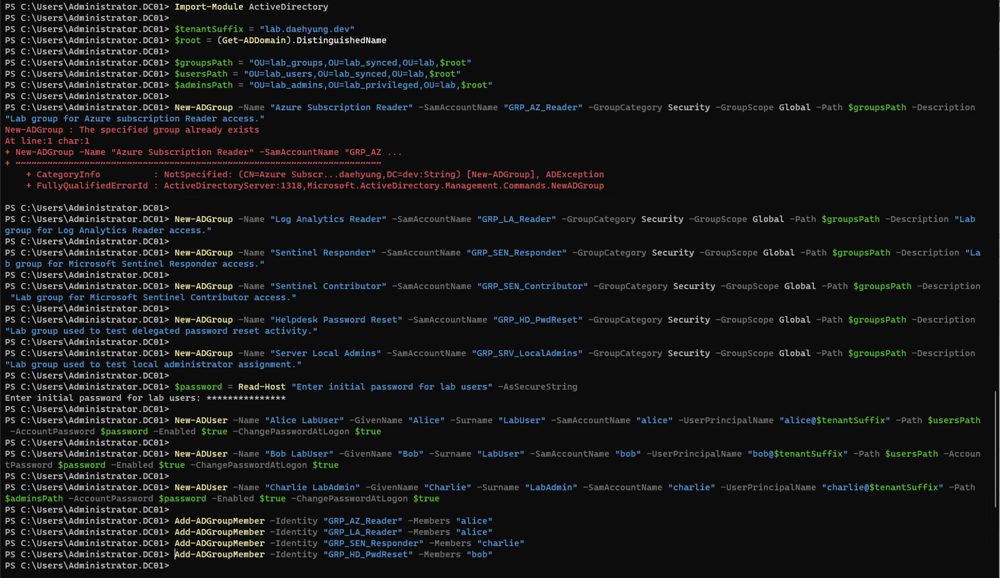

Confirm the groups and lab users in Active Directory Users and Computers.

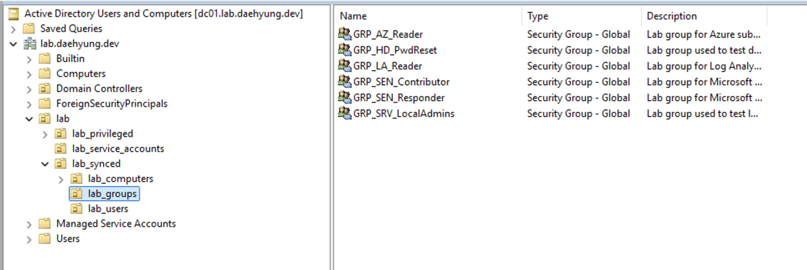

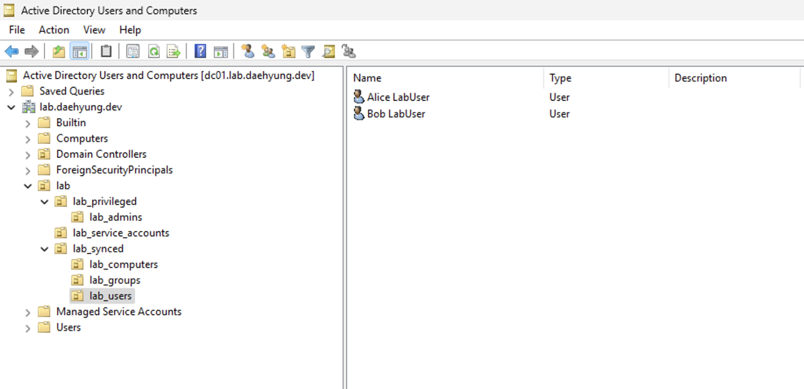


### 1.5 Configure GPO Baselines

Create a small set of GPOs that generate security evidence and are easy to explain.

My implementation

| GPO | Target | Lab purpose |
| --- | --- | --- |
| `GPO-Workstations-WindowsFirewall` | `lab_computers` OU | Confirm firewall policy applies to `winclient01` |
| `GPO-Workstations-AuditPolicy` | `lab_computers` OU | Collect useful endpoint security events |
| `GPO-Domain-AccountPolicy` | Domain root | Set account lockout and password policy |
| `GPO-DC-AdvancedAuditPolicy` | Domain Controllers OU | Generate AD account, group, and directory change events |
| `GPO-Workstations-LocalAdmins` | `lab_computers` OU | Assign a lab group to local admins for controlled testing |

For AD DS monitoring, enable audit categories for account management, security group management, logon, Kerberos activity, and directory service changes. Event ID `5136` needs the right directory object auditing to show object modification details.

## 2. Verify `lab.daehyung.dev` in Microsoft Entra

The AD DS domain and user UPN suffix are both `lab.daehyung.dev`. Confirm that the on-premises user already has the lab UPN suffix.

```powershell
Get-ADUser alice -Properties UserPrincipalName | Select-Object UserPrincipalName
```


Before syncing users, verify `lab.daehyung.dev` as a custom domain in Microsoft Entra ID. In Entra admin center, go to **Identity > Settings > Domain names**, add `lab.daehyung.dev`, then create the TXT record in public DNS for `daehyung.dev`.

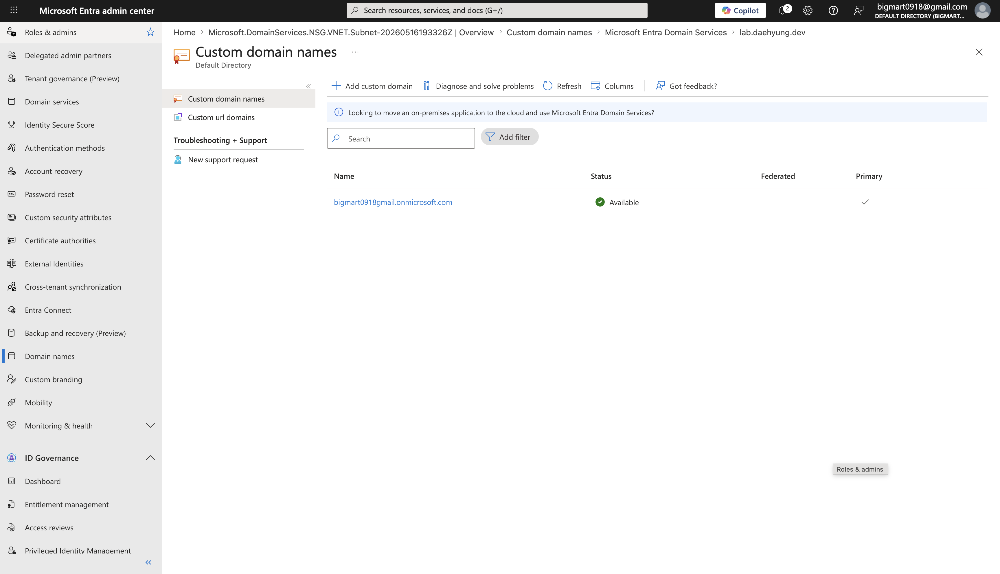

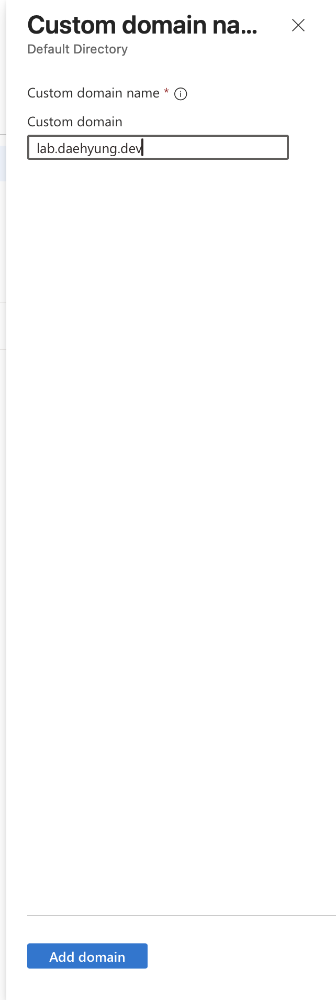


Now the user has an on-premises AD identity with a verified cloud sign in name.

## 3. Install and Configure Microsoft Entra Connect Sync on `dc01`

> [!NOTE]
> We will install Microsoft Entra Connect Sync on `dc01` for this lab. This is a cost-saving choice, not the preferred production design.


### 3.1 Use Custom Settings

Download Microsoft Entra Connect Sync from the Microsoft Entra admin center and run the installer on `dc01`.

We need to be using custom settings for...

- Password Hash Synchronization
- OU filtering
- The OUs that should sync, such as `lab_users`, `lab_groups`, and `lab_computers`
- No AD FS (NOT in this lab)
- Do not sync `lab_service_accounts`.


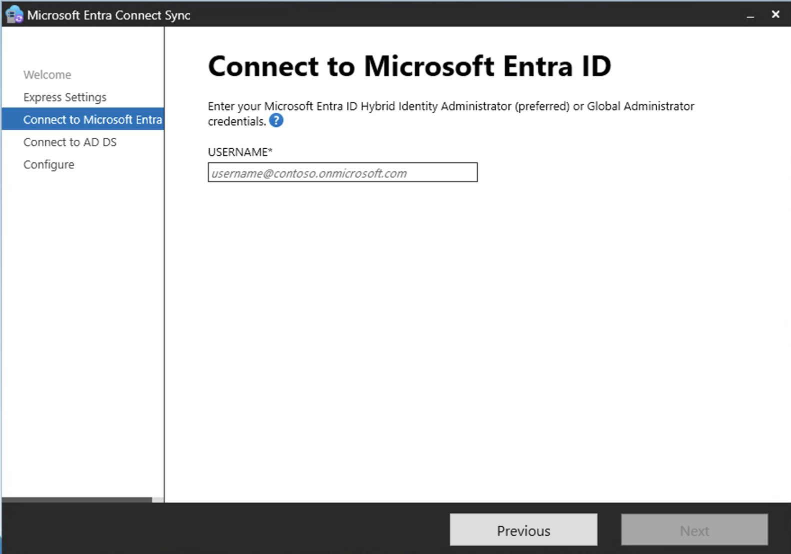

Capture the tenant user list before the first sync so the synced-user proof has a baseline.


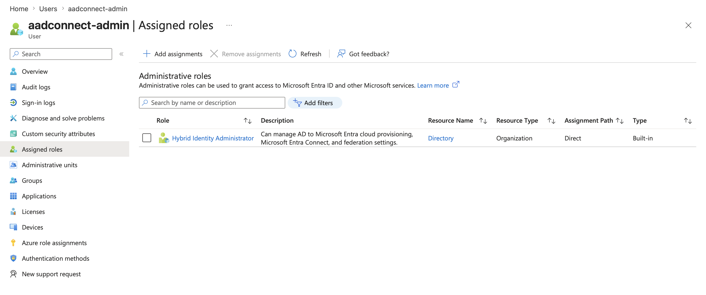

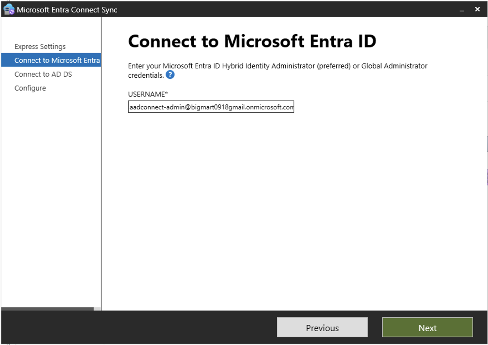


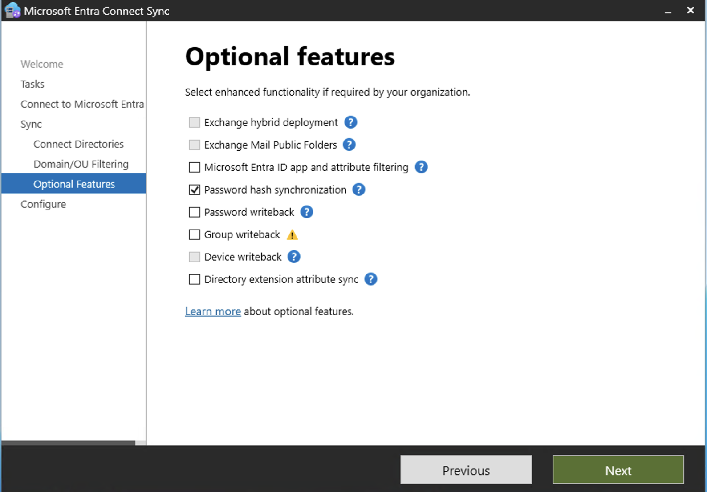

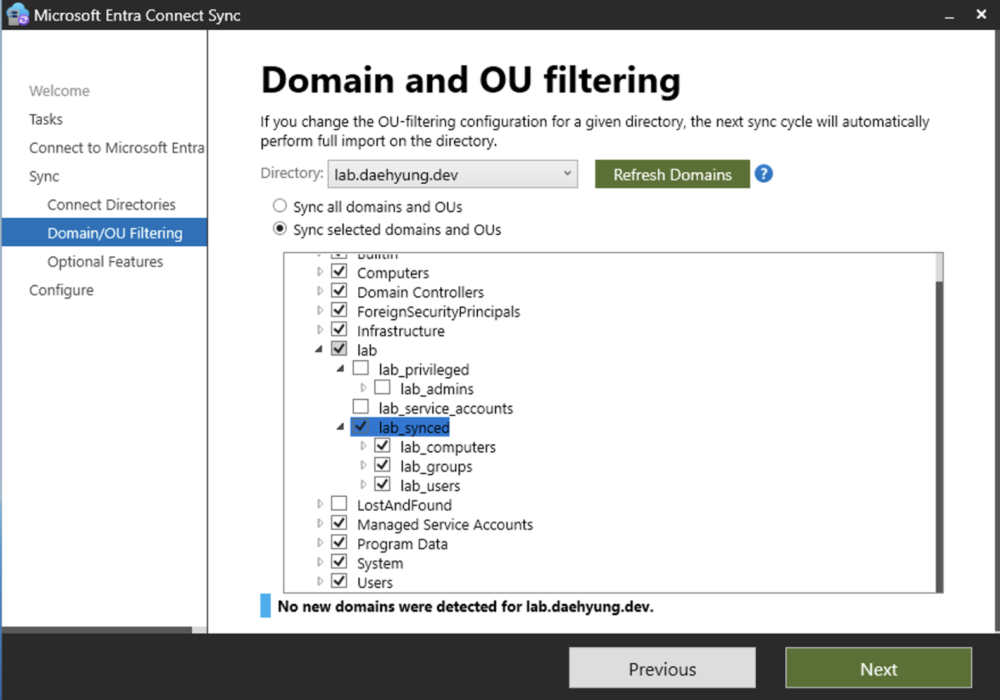


### 3.2 Force the First Sync

After the wizard completes, force a sync to Entra.

```powershell
Import-Module ADSync
Start-ADSyncSyncCycle -PolicyType Delta
```

Use the Synchronization Service Manager to confirm that exports to Microsoft Entra ID are successful.

## 4. Verify Synced Users and Groups in Microsoft Entra

Open the Microsoft Entra admin center and check the synced users and groups.

Checklist:

- Test users from `lab_users` appear in Microsoft Entra ID.
- Lab groups from `lab_groups` appear in Microsoft Entra ID.
- Objects from `lab_service_accounts` do not appear.
- Synced users use the `lab.daehyung.dev` UPN suffix.

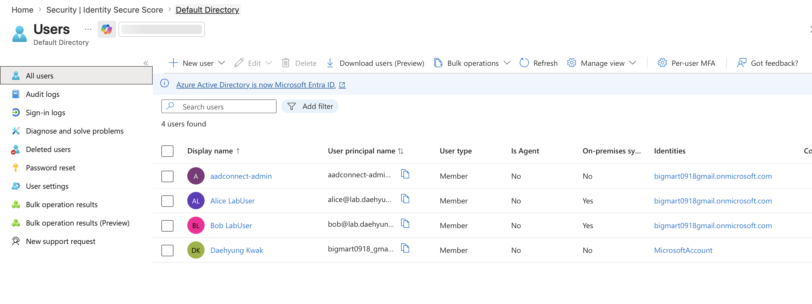

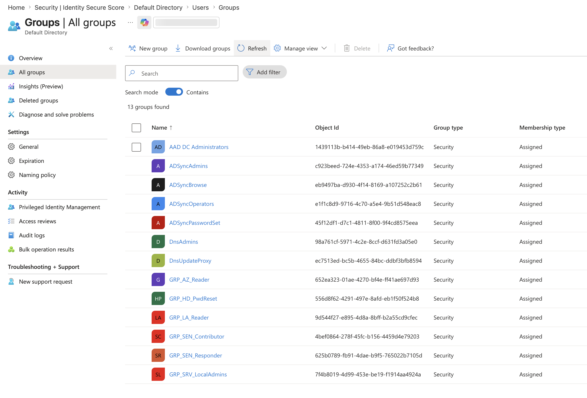

This proves that sync scoping is working and that the lab is not pushing every on-premises object into the Azure tenant.

## 5. Build and Domain-Join `winclient01`

Create `winclient01` as a Windows 11 VM and join the Domain.

```powershell
Add-Computer -DomainName "lab.daehyung.dev" -Restart
```

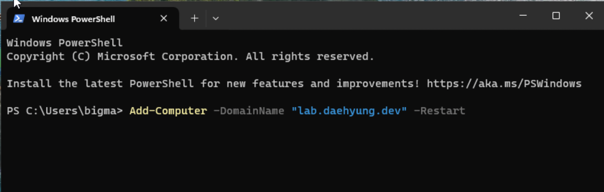

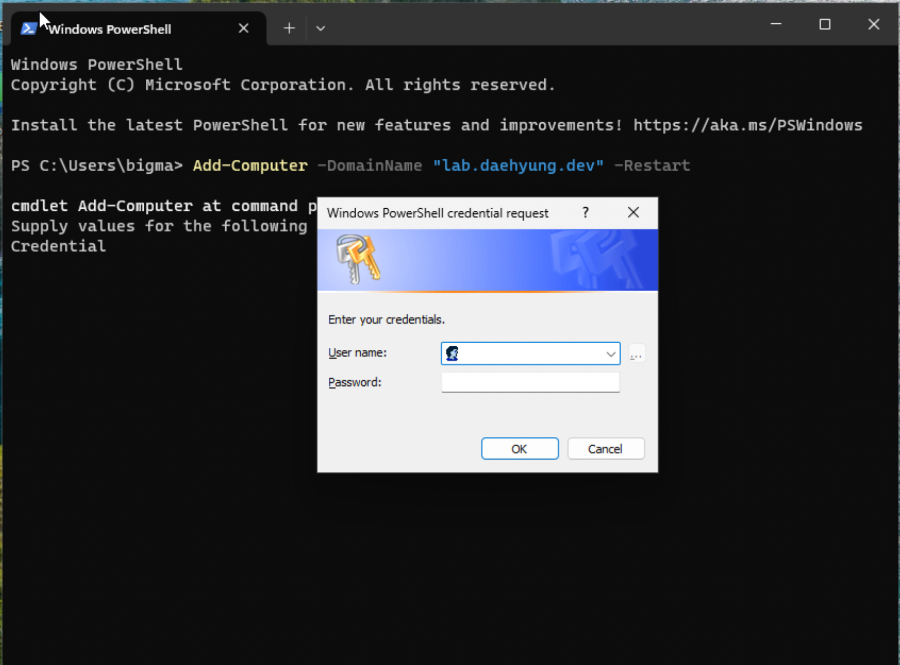

After the restart, `winclient01` can sign in with a LAB domain account.

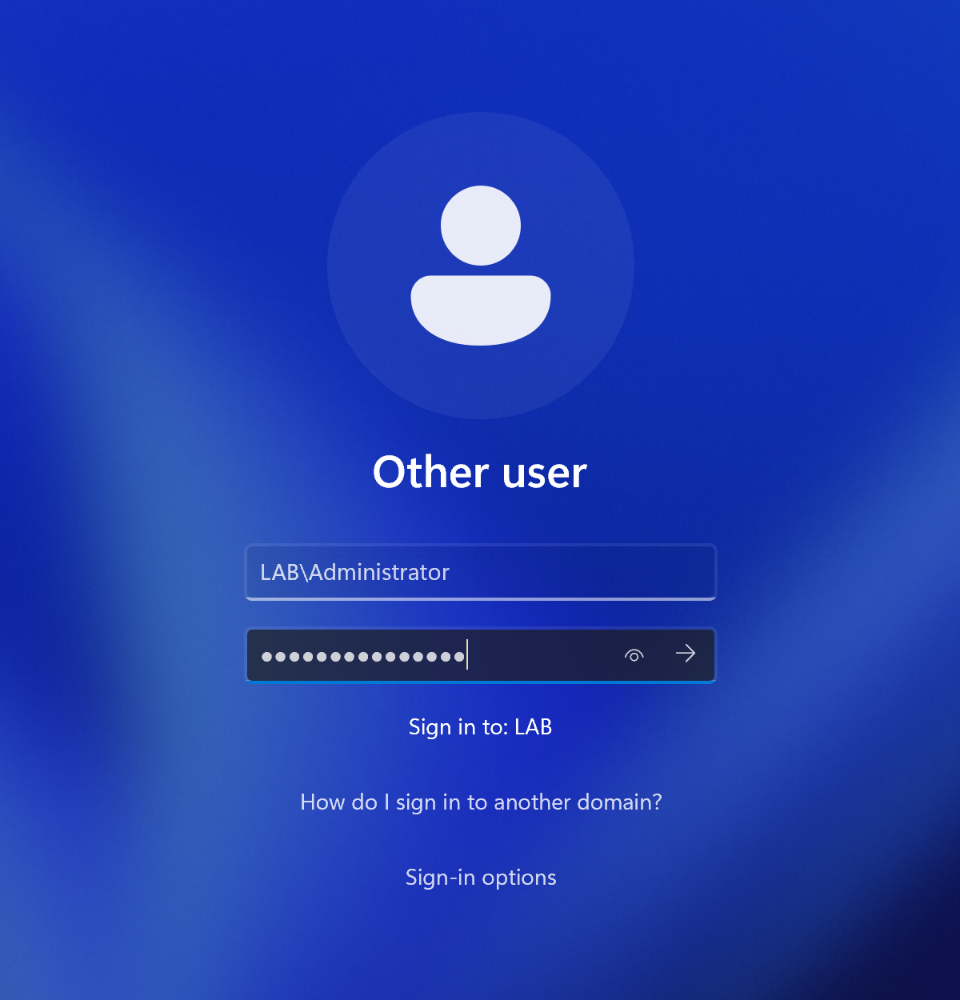

After restart, move the computer object into the `lab_computers` OU.

The first ADUC view shows `WINCLIENT01` in the default `Computers` container.

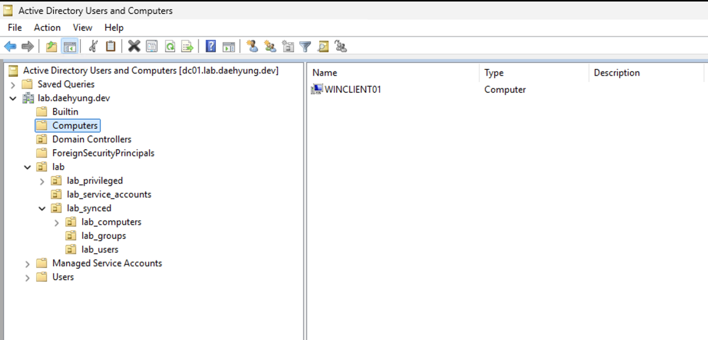

```powershell
Move-ADObject `
  -Identity "CN=WINCLIENT01,CN=Computers,DC=lab,DC=daehyung,DC=dev" `
  -TargetPath "OU=lab_computers,OU=lab_synced,OU=lab,DC=lab,DC=daehyung,DC=dev"
```

The PowerShell output confirms that `WINCLIENT01` now has a distinguished name under `lab_computers`.

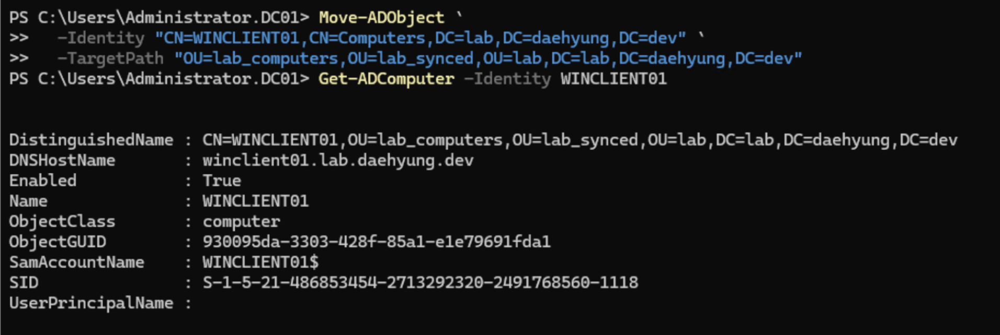

Apply GPO and confirm domain identity.

```powershell
gpupdate /force
whoami
gpresult /r
```

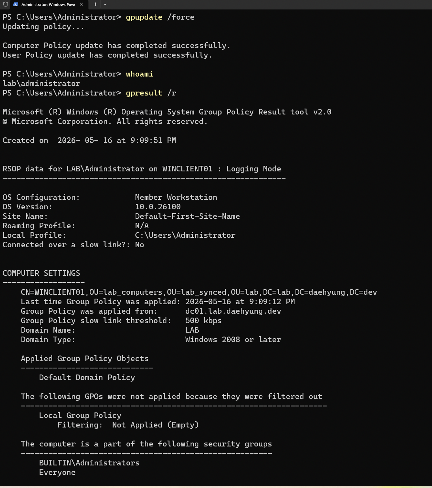

## 6. Configure and Validate Hybrid Join

Configure Microsoft Entra hybrid join for the domain-joined device.

The important requirements are:

- The computer object for `winclient01` is in a synced OU.
- The Service Connection Point is configured by Entra Connect.
- `winclient01` can reach Microsoft registration and sign-in endpoints.
- Device registration completes successfully.

On `winclient01`, run:

```cmd
dsregcmd /status
```

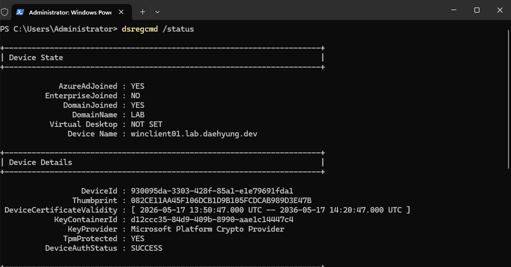

Then confirm the device in Entra.

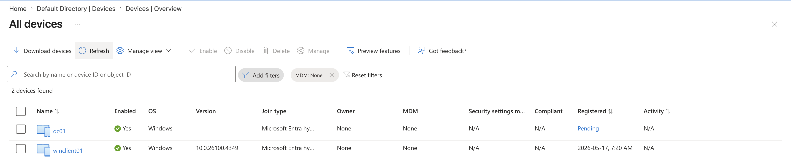

If registration fails, save the `dsregcmd /status` diagnostics. The output can show whether the issue is AD connectivity, SCP configuration, DRS discovery, or token acquisition.

## 7. Configure Log Analytics, AMA, and Microsoft Sentinel

### 7.1 Create the Workspace and Enable Sentinel

Create the Log Analytics workspace `law-hybrid-identity-lab`, then enable Microsoft Sentinel on the workspace.

### 7.2 Collect Windows Security Events

Use Azure Monitor Agent and a Data Collection Rule to collect Windows security events from `dc01` and `winclient01`.

For Sentinel detections, send the Windows Security events to the `SecurityEvent` table. A standard Azure Monitor Windows Event Logs DCR sends Windows events to the `Event` table. The Terraform in `infra/terraform/monitoring.tf` uses the `Microsoft-SecurityEvent` stream so the section 8 KQL queries can run against `SecurityEvent`.

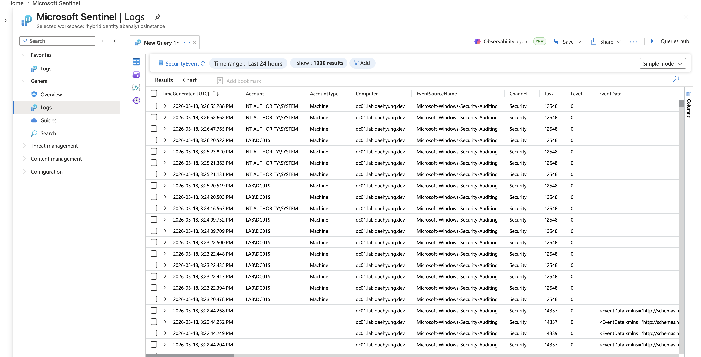

Before creating an analytics rule, confirm that the table has data:

```kql
SecurityEvent
| where TimeGenerated > ago(1h)
| summarize Events=count() by Computer
```

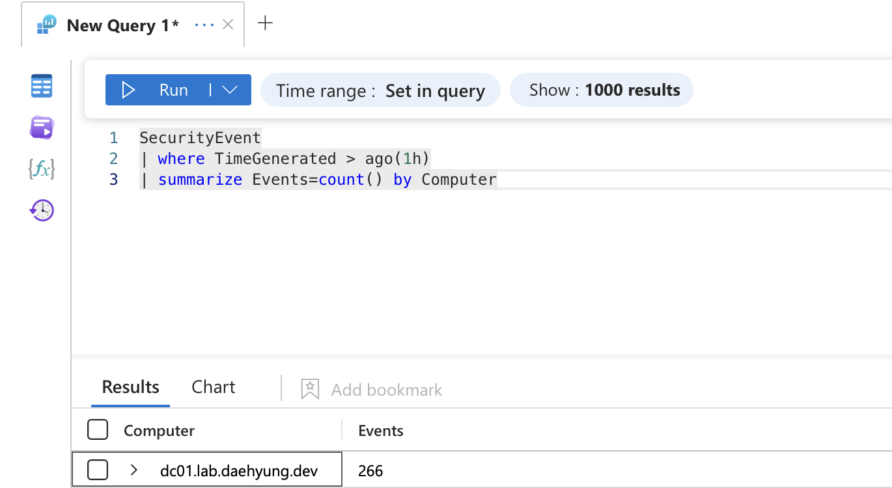

### 7.3 Connect Microsoft Entra Logs

Use the Microsoft Entra ID data connector in Sentinel.

Collect audit logs if available.

## 8. Create and Test KQL Detections

### 8.1 Privileged AD Group Membership Changes

Test action: add a test user to one lab admin group, then remove the user.

```powershell
Add-ADGroupMember -Identity "GRP_SRV_LocalAdmins" -Members "alice"
Remove-ADGroupMember -Identity "GRP_SRV_LocalAdmins" -Members "alice" -Confirm:$false
```

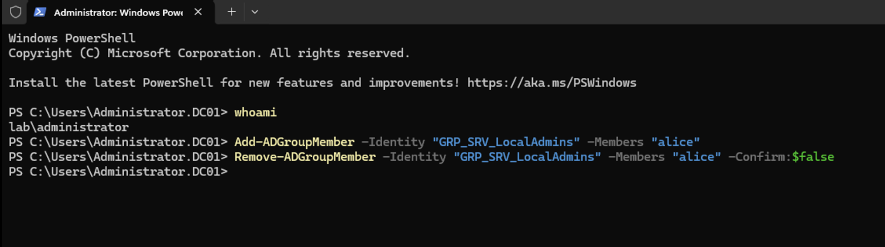

Detection

```kql
let PrivilegedGroups = dynamic([
    "Azure Subscription Reader",
    "Log Analytics Reader",
    "Sentinel Responder",
    "Sentinel Contributor",
    "Helpdesk Password Reset",
    "Server Local Admins",
    "GRP_AZ_Reader",
    "GRP_LA_Reader",
    "GRP_SEN_Responder",
    "GRP_SEN_Contributor",
    "GRP_HD_PwdReset",
    "GRP_SRV_LocalAdmins",
    "Domain Admins",
    "Enterprise Admins",
    "Administrators",
    "Schema Admins",
    "Account Operators"
]);
SecurityEvent
| where EventID in (4728, 4729, 4732, 4733, 4756, 4757)
| where TargetUserName has_any (PrivilegedGroups)
    or TargetAccount has_any (PrivilegedGroups)
    or MemberName has_any (PrivilegedGroups)
| project TimeGenerated, Computer, EventID, Activity, Account, SubjectAccount, TargetAccount, TargetUserName, MemberName
| order by TimeGenerated desc
```

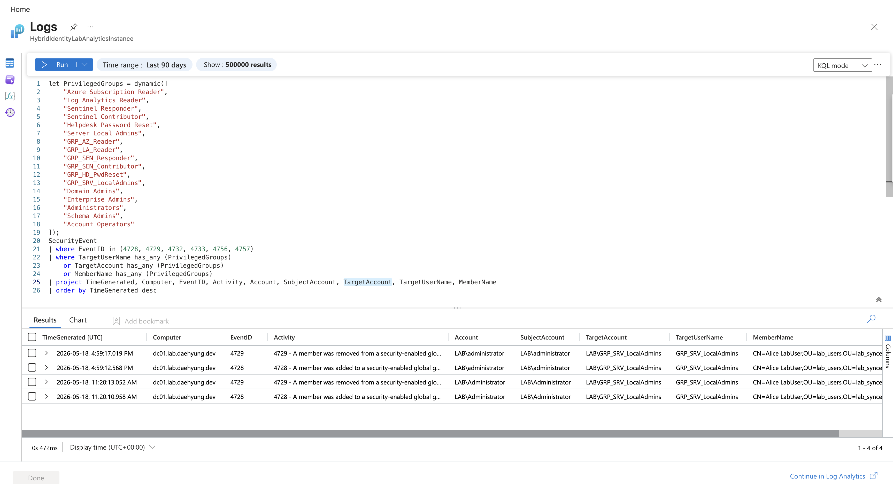

This detection shows when an identity gains or loses privileged access through AD group membership.

### 8.2 Password Reset, Disabled Account, or Deleted Account Activity

Reset a test user's password, disable the account, then re-enable it.

```powershell
Set-ADAccountPassword -Identity "alice" -Reset -NewPassword (ConvertTo-SecureString "TempPassword123!" -AsPlainText -Force)
Disable-ADAccount -Identity "alice"
Enable-ADAccount -Identity "alice"
```

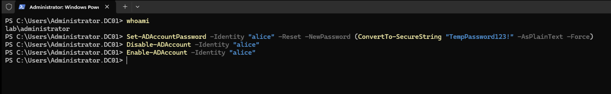

Detection

```kql
SecurityEvent
| where EventID in (4724, 4725, 4726)
| summarize Count=count() by EventID, Account, Computer, bin(TimeGenerated, 1h)
| order by TimeGenerated desc
```

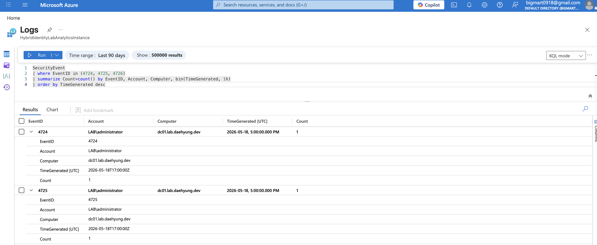

This detection helps review account takeover response actions and suspicious account administration.

### 8.3 GPO or AD Object Modification Trail

Change a setting in a test GPO.

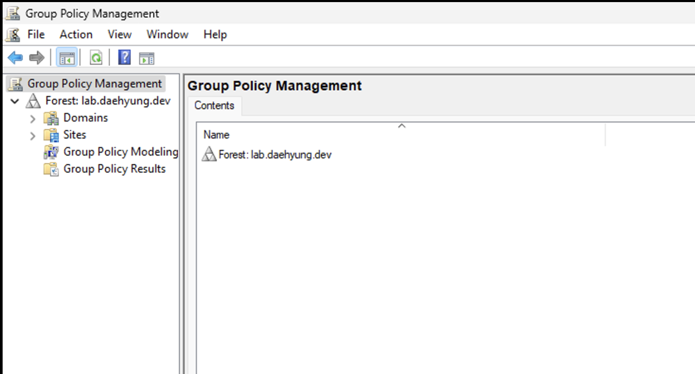

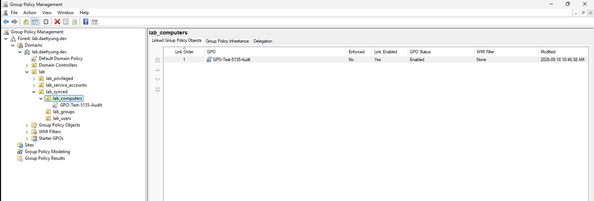

Detection

```kql
SecurityEvent
| where EventID == 5136
| where ObjectName has "CN=Policies,CN=System"
| project TimeGenerated, Computer, Account, SubjectAccount, ObjectName, ObjectType, OperationType
| order by TimeGenerated desc
```

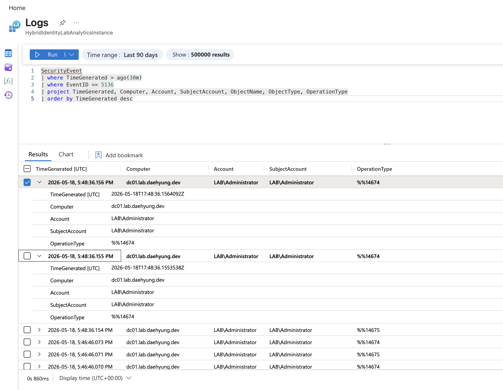

This detection shows changes to AD objects that can affect many users or computers.

### 8.4 New Privileged Role Assignment in Microsoft Entra

Assign a test role to a lab group, then remove it.

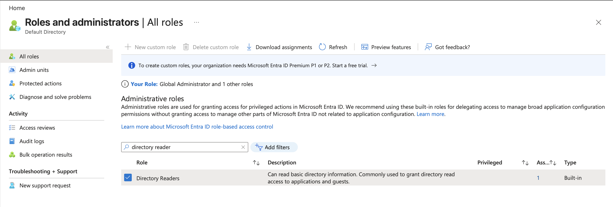

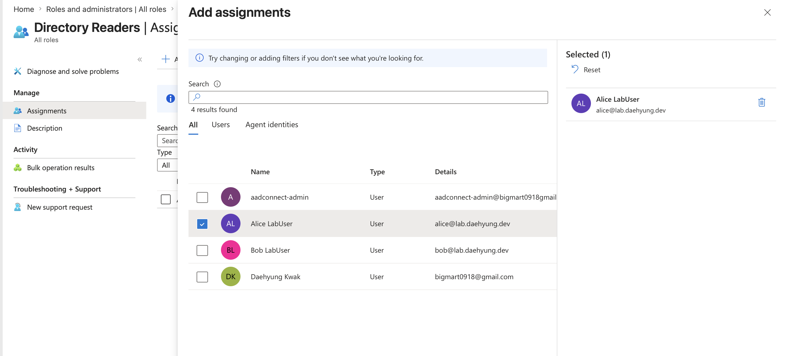

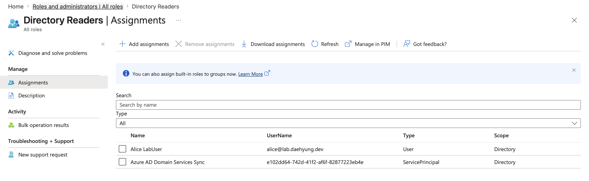

Detection

```kql
AuditLogs
| where Category == "RoleManagement"
| where ActivityDisplayName has_any (
    "Add member to role",
    "Add eligible member to role",
    "Add member to role outside of PIM"
)
| project TimeGenerated, ActivityDisplayName, InitiatedBy, TargetResources, Result
| order by TimeGenerated desc
```

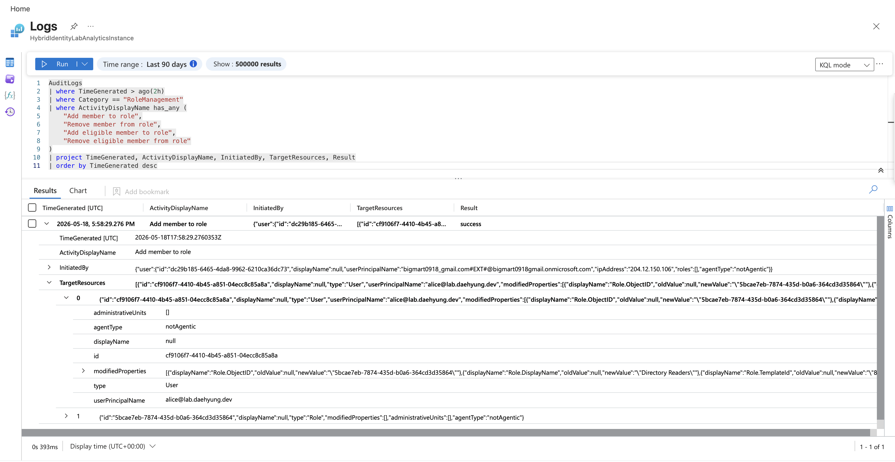

This detection shows cloud-side privileged role assignment activity.

### 8.5 Failed Entra Sign-In Spike

Generate failed sign-ins against a lab user without locking the account.

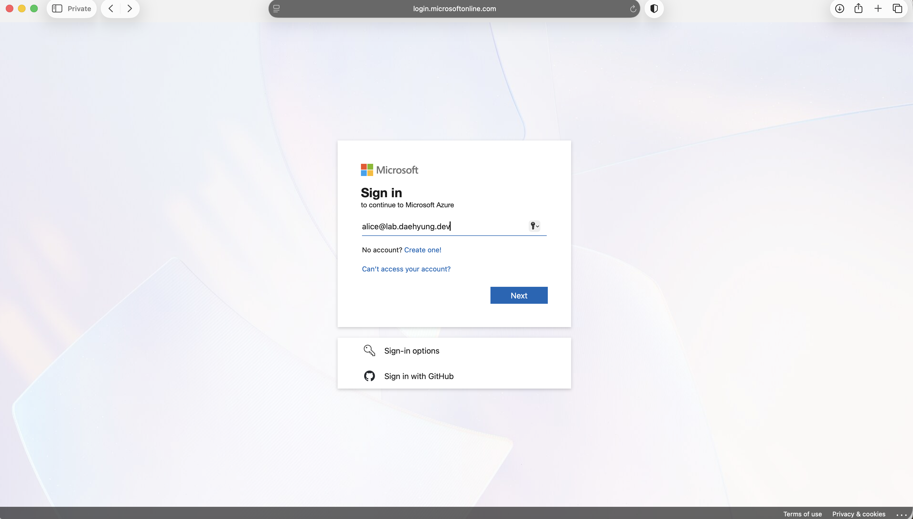

Detection

```kql
SigninLogs
| where tostring(ResultType) != "0"
| summarize FailedAttempts=count(),
    UserCount=dcount(UserPrincipalName),
    IPCount=dcount(IPAddress)
    by bin(TimeGenerated, 15m)
| where FailedAttempts >= 10
| order by TimeGenerated desc
```

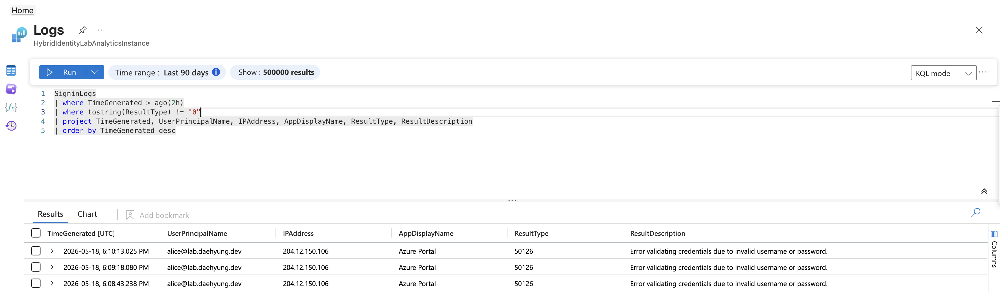

These detections show that the lab can turn identity activity into Sentinel query evidence and alert candidates.

## 9. RBAC, Emergency Access, and Conditional Access Design

### 9.1 Azure and Sentinel RBAC

Use group-based access instead of assigning users directly.

Recommended mapping:

| Synced group | Azure or Sentinel role |
| --- | --- |
| `Azure Subscription Reader` (`GRP_AZ_Reader`) | Reader on the subscription |
| `Log Analytics Reader` (`GRP_LA_Reader`) | Log Analytics Reader on the workspace |
| `Sentinel Responder` (`GRP_SEN_Responder`) | Microsoft Sentinel Responder |
| `Sentinel Contributor` (`GRP_SEN_Contributor`) | Microsoft Sentinel Contributor |

Keep role assignment cumulative behavior in mind. If a user has multiple role paths, the effective permission is the sum of those assignments.

After the AD groups sync into Microsoft Entra ID, add their object IDs to `infra/terraform/terraform.tfvars` and run Terraform again. Terraform can then assign the Azure and Sentinel roles from code.

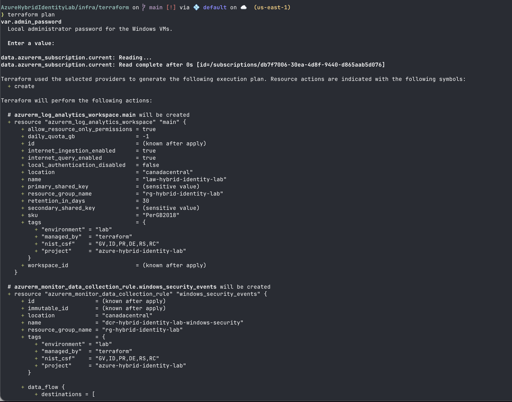
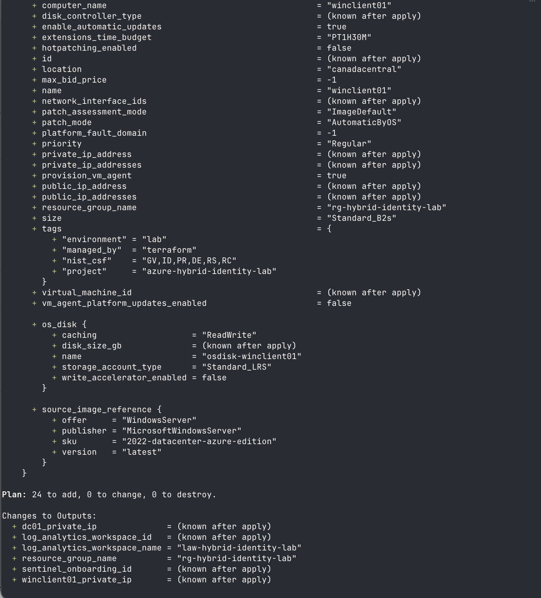

### 9.2 Emergency Access Accounts

Create two cloud-only emergency access accounts. These accounts should not depend on AD DS, Entra Connect Sync, or the normal admin authentication path.

Document:

- Account names
- Where credentials are stored
- Which roles are assigned
- Which Conditional Access policies exclude them
- When the accounts are tested

Do not sync emergency access accounts from AD DS.

### 9.3 Security Defaults, Conditional Access, and PIM

Implement a small pilot Conditional Access policy:

- Target a pilot admin group first.
- Require MFA for privileged admin access.
- Exclude emergency access accounts.
- Test with report-only mode first if available.


## 10. References

- [Securing domain controllers against attack](https://learn.microsoft.com/en-us/windows-server/identity/ad-ds/plan/security-best-practices/securing-domain-controllers-against-attack)
- [Microsoft Entra Connect prerequisites](https://learn.microsoft.com/en-us/entra/identity/hybrid/connect/how-to-connect-install-prerequisites)
- [Microsoft Entra Connect accounts and permissions](https://learn.microsoft.com/en-us/entra/identity/hybrid/connect/reference-connect-accounts-permissions)
- [Microsoft Entra Connect Sync service account](https://learn.microsoft.com/en-us/entra/identity/hybrid/connect/concept-adsync-service-account)
- [Microsoft Entra hybrid join verification](https://learn.microsoft.com/en-gb/entra/identity/devices/how-to-hybrid-join-verify)